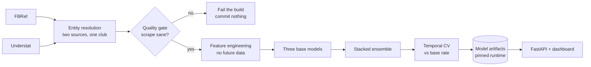

<p align="center">
  
</p>

<h1 align="center">StatStriker</h1>

<p align="center">
  <strong>Premier League Match Prediction Engine</strong><br>
  Scraping &rarr; Feature Engineering &rarr; Stacked Match Models &rarr; Web Dashboard
</p>

<p align="center">
  
  
  
  
</p>

---

## Overview

**Football prediction is easy to do badly and hard to check.** A model trained on a season of
results will happily report 60% accuracy and be worthless, because it learned from information that
did not exist when the match kicked off. Nothing in the output looks wrong.

StatStriker is built around that problem. It scrapes match data from two independent sources,
engineers features under a strict rule that nothing may see the future, blends three deliberately
dissimilar models, and scores everything against a base-rate baseline so a number always has
something to be compared to.

It then runs itself. Scraping, validation, retraining and release happen weekly through GitHub
Actions, and the live API serves whatever last passed.

**What it is for:** a worked example of shipping a model that keeps working after you stop
watching it — versioned artifacts, quality gates, leakage guards, and a public endpoint that
reports its own health.

## Architecture



The whole chain runs weekly in GitHub Actions. Artifacts are built in CI on a pinned runtime and
must reload in a fresh process before release.

## Features

- **Live Match Predictions** — Select any two Premier League teams and get win/draw/loss probabilities with scoreline distributions
- **Three-Model Ensemble** — Dixon-Coles, a feature Poisson GLM and a gradient-boosted classifier, combined via learned stacking weights
- **Team Analytics** — Season stats, goal difference charts, xG trends, home/away splits, and form streaks
- **Upcoming Fixtures** — Live fixture data from the Fantasy Premier League API with one-click predictions
- **Automated Pipeline** — Weekly scraping, processing, and retraining via GitHub Actions with smart change detection

## Model Architecture

Three base models, chosen for disagreeing with each other rather than for being individually best.

| Tier | Model | Description |
|------|-------|-------------|
| 1 | **Dixon-Coles** | Independent Poisson with rho correction for low-score draws and exponential time decay (Dixon & Coles, 1997) |
| 2 | **Feature Poisson GLM** | Adds rolling form features (PPDA, xG overperformance, prior-season stats) as log-linear covariates with L2 regularization |
| 3 | **Gradient Boost** | Discriminative classifier over rolling form features — the one tier that never models goals, mapping form straight to 1X2 and calibrated by shrinkage towards the base rate |
| 4 | **Stacked Ensemble** | Softmax-weighted convex combination of Tiers 1-3, trained on out-of-fold temporal CV predictions |

All models are evaluated using **Ranked Probability Score (RPS)** via expanding-window temporal cross-validation — no data leakage, no shuffling.

## Challenges

The four problems that shaped the design. Each one is the kind that produces no error message.

### Two sources spell the same club differently

Manchester United, Man United, Man Utd. Joining on a name that does not match exactly gives one
club another club's history — and **the row count stays correct**, so nothing signals a problem.
Entity resolution runs on normalised names with fuzzy matching, and a test asserts that two
distinct clubs are never merged into one.

### A feature can see the future without looking like it

Season-total statistics are the obvious trap: a rolling average that includes the match being
predicted will produce excellent accuracy and no warning. Every feature is built from matches
strictly before kick-off, evaluation uses expanding-window temporal cross-validation rather than
shuffled k-fold, and the test suite contains explicit guards for the patterns that reintroduce
leakage.

### A model that reloads on one machine may not reload on another

A serialised model carries references to library internals. When the training host and the serving
host disagree on a version, loading fails on a path nobody tested — and it fails in production, not
in CI. Artifacts are therefore built in CI on a **pinned runtime**, and each one must reload
successfully in a fresh process before release. The health endpoint reports the runtime versions it
is actually running, so a mismatch is visible rather than inferred.

### More models is not more information

The blend originally carried five. Measured out of fold, two of them tracked Dixon-Coles closely
enough to be the same model written twice — so they cost compute and added nothing. **An ensemble
is only worth its cost when its members disagree**, which is why the three that remain were chosen
for being dissimilar rather than for being individually best.

## Why these tools

| Choice | Instead of | Reason |
|---|---|---|
| **Two sources** | One source | A single source cannot be checked. Disagreement between two is the only signal that either is wrong |
| **Dixon-Coles** | Only a classifier | It models goals, so it produces a full scoreline distribution rather than three probabilities |
| **Gradient boosting** | A third Poisson variant | Deliberately the one member that never models goals — it fails differently from the others |
| **RPS** | Accuracy | Football has three ordered outcomes. Accuracy treats a confident wrong answer the same as an uncertain one; RPS does not |
| **Temporal CV** | k-fold | Shuffling lets the model train on the future. The number it produces would be higher and meaningless |
| **Parquet** | CSV | Typed and columnar, so a scraped float does not silently become a string between runs |
| **CI-built artifacts** | Training locally | The training and serving runtimes must be identical, and CI is the only place that can be guaranteed |
| **FastAPI** | Flask | Type hints validate the request shape, and the schema documents itself |
| **Render** | A VM | The service is small and the deployment should not need maintaining |

## Project Structure

```
StatStriker/
├── scrapers/               # Data collection
│   ├── base_scraper.py     # Abstract base with rate limiting & retry logic
│   ├── fbref_scraper.py    # FBRef: goals, shots, possession, xG
│   └── understat_scraper.py # Understat: match xG, PPDA, deep stats
├── processors/             # Data processing
│   ├── entity_resolver.py  # Fuzzy team name matching (rapidfuzz)
│   ├── schema_normalizer.py # Cross-source schema alignment
│   └── feature_engineer.py # Rolling features, form metrics
├── models/                 # Prediction models
│   ├── dixon_coles.py      # Tier 1: Classic Dixon-Coles
│   ├── feature_poisson.py  # Tier 2: Feature GLM
│   ├── gradient_boost.py   # Tier 3: Gradient-boosted classifier
│   ├── ensemble.py         # Tier 4: Stacked ensemble
│   ├── evaluation.py       # Temporal CV + RPS scoring
│   └── predict.py          # Unified prediction interface
├── app/
│   └── api.py              # FastAPI backend (serves frontend + API)
├── frontend/
│   └── index.html          # Single-page dashboard (vanilla JS + GSAP)
├── data/
│   ├── raw/                # Per-source CSVs (gitignored)
│   ├── processed/          # Merged Parquet files
│   └── models/             # Trained model artifacts (.pkl)
├── main.py                 # CLI entry point
├── render.yaml             # Render deployment config
└── .github/workflows/
    └── pipeline.yml        # Weekly automated pipeline
```

## Quick Start

### Prerequisites

- Python 3.12+
- A [ScraperAPI](https://www.scraperapi.com/) key (for data collection only)

### Installation

```bash
git clone https://github.com/BhunZ/StatStriker.git
cd StatStriker
pip install -r requirements.txt
```

### Run the API locally

```bash
uvicorn app.api:app --reload
```

Open `http://localhost:8000` in your browser — the dashboard is served directly by FastAPI.

### Run the full pipeline

```bash
cp .env.example .env        # Add your SCRAPER_API_KEY
python main.py --auto        # Smart mode: scrape, process, train as needed
```

### CLI Options

```
python main.py --auto              # Smart: only scrape/train if data is stale
python main.py --scrape            # Scrape only (saves raw CSVs)
python main.py --process           # Process existing raw data
python main.py --force-train       # Force model retraining
python main.py --evaluate          # Full temporal cross-validation
python main.py --predict Arsenal Chelsea  # Quick prediction
```

## Data Sources

| Source | What | How |
|--------|------|-----|
| **FBRef** | Goals, shots, possession, xG | HTML scraping via ScraperAPI |
| **Understat** | Match xG, PPDA, deep stats | Internal JSON API |
| **FPL API** | Upcoming fixtures | Public REST API (no key needed) |

FBRef is the ground truth for goals scored. Understat is the ground truth for xG. Team names from all sources are resolved to canonical form via `EntityResolver` using a hand-curated alias map with rapidfuzz fallback.

## Deployment

StatStriker is configured for one-click deployment on **Render** (free tier):

1. Fork/push to GitHub
2. Connect repo on [render.com](https://render.com)
3. Render auto-detects `render.yaml` — click Deploy

The frontend and API run as a single service. The API URL is auto-detected (localhost for dev, deployed origin in production).

## Automation

The GitHub Actions workflow (`.github/workflows/pipeline.yml`) runs every Monday at 06:00 UTC:

1. Scrapes latest match data from FBRef + Understat
2. Processes and merges new data
3. Retrains models if new matches are found
4. Commits updated artifacts back to the repo

Exit codes enable smart CI/CD: `0` = no changes, `2` = new data, `3` = retrained.

## Tech Stack

| Layer | Technology |
|-------|-----------|
| Scraping | requests, BeautifulSoup, ScraperAPI |
| Data | pandas, PyArrow (Parquet) |
| Modeling | scipy (L-BFGS-B optimization), NumPy, scikit-learn |
| Matching | rapidfuzz |
| API | FastAPI, uvicorn, httpx |
| Frontend | Vanilla JS, GSAP, CSS Glass UI |
| CI/CD | GitHub Actions |
| Deployment | Render |

## License

MIT

---

<p align="center">
  Built with data, math, and too much coffee.
</p>
